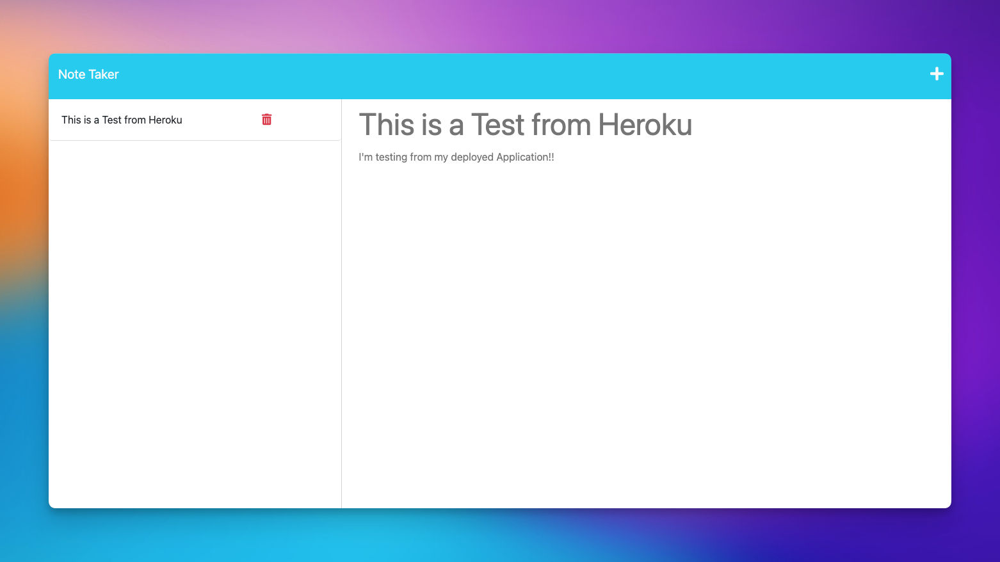

# Express.js Note Taker

## User Story
`AS` A small business owner  
`I WANT` to be able to write and save notes  
`SO THAT` I can organize my thoughts and keep track of tasks I need to complete  

## Acceptance Criteria
`GIVEN` a note-taking application  
`WHEN` I open the Note Taker  
`THEN` I am presented with a landing page with a link to a notes page  
`WHEN` I click on the link to the notes page  
`THEN` I am presented with a page with existing notes listed in the left-hand column, plus empty fields to enter a new note title and the note’s text in the right-hand column  
`WHEN` I enter a new note title and the note’s text  
`THEN` a Save icon appears in the navigation at the top of the page  
`WHEN` I click on the Save icon  
`THEN` the new note I have entered is saved and appears in the left-hand column with the other existing notes  
`WHEN` I click on an existing note in the list in the left-hand column  
`THEN` that note appears in the right-hand column  
`WHEN` I click on the Write icon in the navigation at the top of the page  
`THEN` I am presented with empty fields to enter a new note title and the note’s text in the right-hand column  

## Overview
The goal of this project is to create a Note Taker application that can be used to write and save notes. The application uses an Express.js back end where data is saved and retrieved through a JSON file.

A live version of this application that has been deployed to Heroku can be viewed [here](https://notable-express-8aaf810a65bf.herokuapp.com/)

## Installation
To get started, clone the repository from the provided link. Then, enter the project directory and use your preferred package manager to install the necessary dependencies.

## Usage
After completing the installation, start the application to view, delete, and create notes.

## Technologies Used
* Express 
* Heroku 

## Reflection
This project has allowed me to apply the core skills I have recently learned and put them into practice. During development, I had the opportunity to deepen my understanding of Express, routes, and requests. Additionally, I developed a deeper appreciation for for the importance code commenting, and the development principal DRY. (Don't repeat yourself). In the future, I would like to give users the ability to edit existing notes.

## Questions
If you have any questions or need further assistance, feel free to reach out to me: 
- **Email:** bickel@hey.com
- **GitHub:** [@briimcfly](https://github.com/briimcfly)